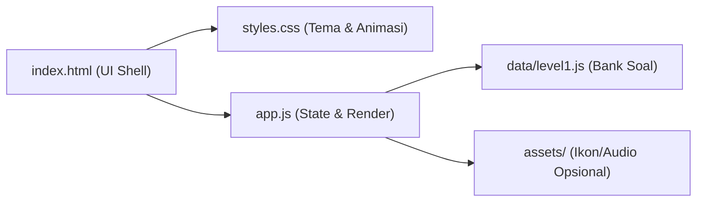

## 1. Desain Arsitektur
Aplikasi web statis (tanpa backend) dengan pemisahan data soal, logika permainan, dan tampilan UI.



## 2. Deskripsi Teknologi
- Frontend: HTML5 + CSS3 + JavaScript (ES Modules, ES2020).
- Ketergantungan: tidak ada (tanpa library eksternal).
- Data: array objek di file JS (mudah ditambah untuk level berikutnya).

## 3. Definisi Rute
| Rute | Tujuan |
|---|---|
| / | Single-page app berbasis state (Mulai → Kuis → Hasil) |

## 4. API
Tidak ada API (offline-first).

## 5. Model Data

### 5.1 Skema Soal
Setiap soal memiliki kata Jepang, teks pertanyaan Indonesia, tiga opsi jawaban, dan indeks jawaban benar.

```js
{
  id: "l1-q1",
  level: 1,
  promptId: "meaning",
  word: { kana: "いぬ", romaji: "inu" },
  questionId: "meaningOfWord",
  options: [
    { id: "A", idn: "Kucing", jp: { kana: "ねこ", romaji: "neko" } },
    { id: "B", idn: "Anjing", jp: { kana: "いぬ", romaji: "inu" } },
    { id: "C", idn: "Burung", jp: { kana: "とり", romaji: "tori" } }
  ],
  correctOptionId: "B"
}
```

### 5.2 State Permainan
- `level`: nomor level aktif (awal: 1)
- `questionIndex`: indeks soal saat ini
- `score`: skor berjalan
- `sessionQuestions`: daftar soal (hasil shuffle)

## 6. Struktur Folder
- `index.html`
- `css/styles.css`
- `js/app.js`
- `js/data/level1.js`
- `assets/` (opsional)

## 7. Aturan Implementasi
- Tiap sesi Level 1 selalu 10 soal.
- Jawaban sekali klik (disable tombol setelah memilih).
- Feedback instan (benar/salah) selalu menampilkan jawaban yang tepat saat salah.
- Tombol “Main Lagi” mengulang dengan urutan soal diacak.
